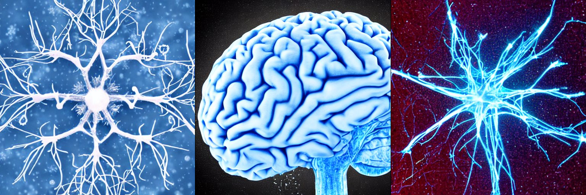
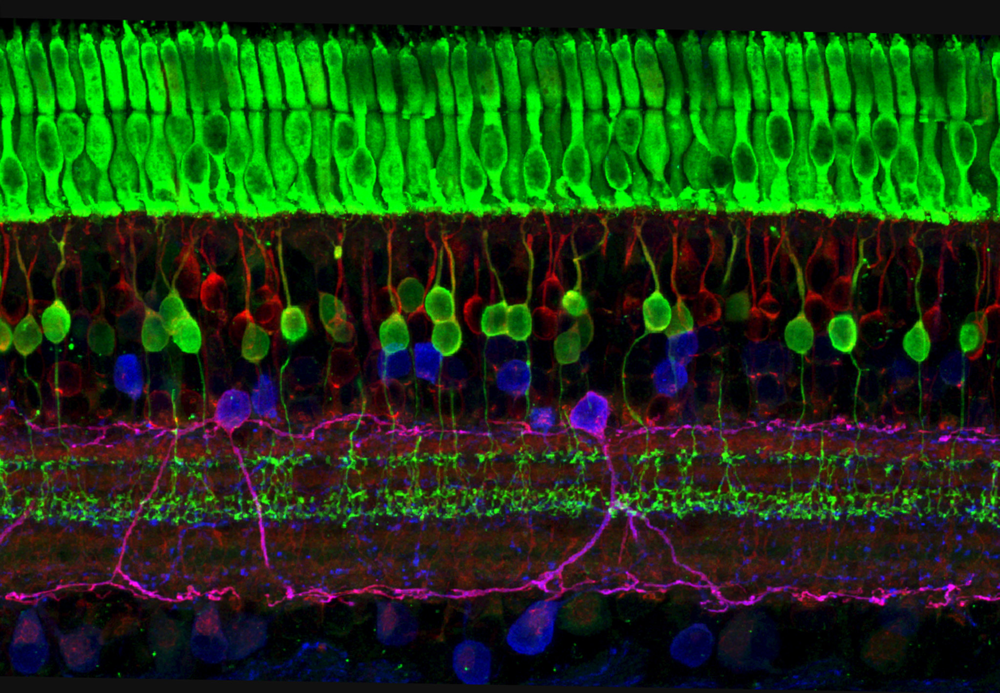
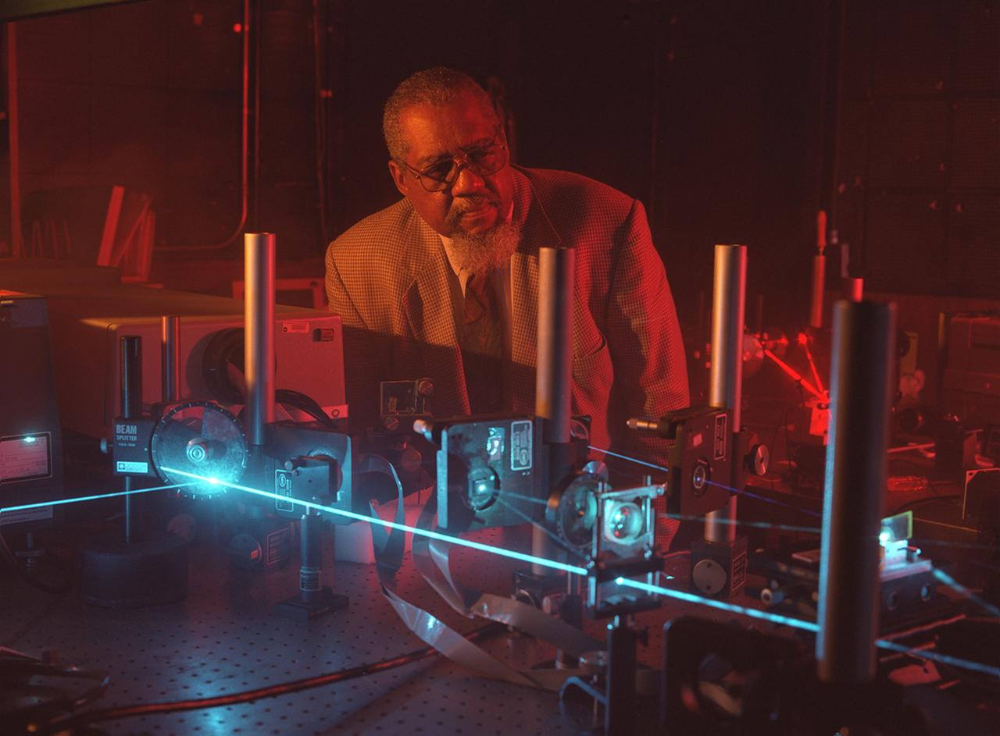
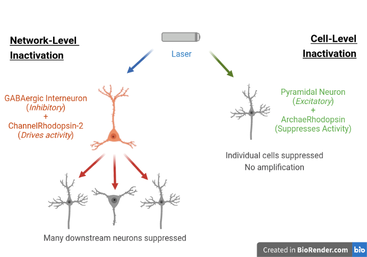
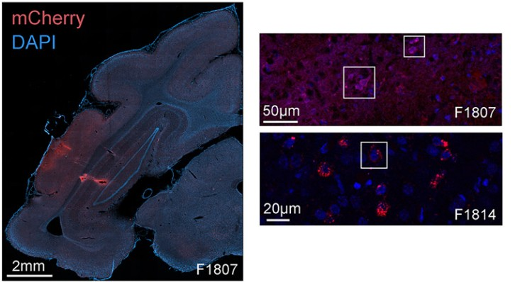
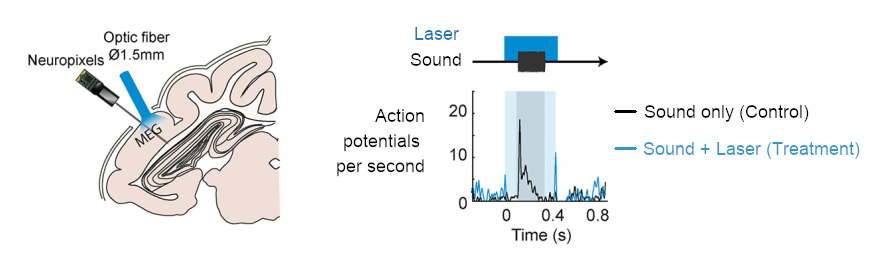
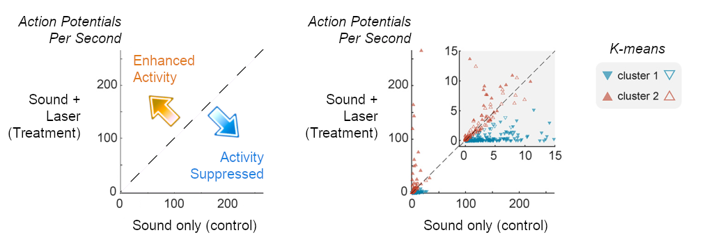

Delighted to announce the publication in [this week's Journal of Neuroscience of our latest study](https://www.jneurosci.org/content/43/5/749), funded by the BBSRC and Wellcome Trust, in which we used reversible inactivation to better understand the role of auditory cortex in hearing and cognition.

<figure>
  
  <figcaption align="center">Image generated by Stable Diffusion AI</figcaption>
</figure>

Huge thanks go to an excellent team of co-authors: Katarina Poole, Katherine Wood and Jenny Bizley. An open-access version of the paper is also available [here](https://github.com/stephentown42/cooling_auditory_cortex/blob/main/ePMC_manuscript.pdf), as part of the [GitHub repository](https://github.com/stephentown42/cooling_auditory_cortex) that also contains all the data and analysis code.

The paper is the first time we’ve been able to use a powerful method called Optogenetics to control neural activity using light and represents an important technical advance for the lab. Together with another approach (cortical cooling), we show that reversible inactivation of primary auditory cortex impairs the ability to locate sounds sources and separate them from background noise. Our findings shed light on predictions from a controversial theory about how the brain processes sound features, giving us new data on the links between neural processing and auditory behavior.

If you’re interested in learning more, the rest of this article covers the optogenetic work, led by Katarina Poole and Jenny Bizley. In a follow-up post next week, I'll cover the theoretical implications of the behavioral results for hearing research and our understanding of the sensory brain.

---

## Quick summary: What are Optogenetics?

Optogenetics is a powerful technology for controlling brain activity using light. It builds upon our understanding of the biology of vision, where proteins in cells within the eye transform light into electrochemical signals. These proteins are known as opsins and can be found in animals, but also in bacteria and algae.

In mammals, opsins are found in photoreceptor cells in the eye. However in the 2000s, researchers showed that it was possible to extract and modify the genes that code for opsins in microbes and then express those genes in mammalian cells. When opsins are artificially expressed in neurons, it becomes possible to use light to influence the signals known as action potentials, through which neurons communicate with one another.

<figure>
  
  <figcaption align="center">Inspiration from vision: Cross-section of the retina, showing the layer of photoreceptors (top, green) in which light is converted into electrochemical activity. The cells below use action potentials to communicate and process sensory information. Credit: Wei Li, National Eye Institute, National Institutes of Health</figcaption>
</figure>

Here, we induced expression a particular opsin known as ChannelRhodopsin-2 in neurons that drive inhibition within the cerebral cortex. Stimulating these cells with blue light, we were able to suppress cortical activity on a millisecond time scale, and show that neural activity in auditory cortex contributes to specific aspects of hearing.

<i>If you're interested in learning more about Optogenetics, check out [this review](https://www.nature.com/articles/465026a) of the field's origins.</i>

---

## Why are Optogenetics so useful?

We've been working for a number of years to integrate optogenetic methods into our research, starting back in 2014 with a pilot grant from RNID to explore their viability in carnivore species. Until that point, the approach had primarily been used with rodents such as mice and rats, where it had been a game-changer for three main reasons:

1. Speed: Light is fast, and its effects on neurons can be seen within milliseconds. That's important, because neural computations are performed rapidly - think, for example, of the time it takes for you to read each word of this paragraph. Each action is based on a chain of events within your brain taking place much faster than you can think (<i>because it is how you think!</i>). Other techniques like pharmacological agents (i.e. drugs) are much slower and act over minutes or hours, with much poorer temporal control. Optogenetics may thus have the temporal resolution to one day introduce information into the brain at the speed of thought.

2. Precision: As well as being slow, drugs also have off-target effects, especially when administered systemically (i.e. via pill or intravenous injection). In contrast, optogenetics can be focused to a small area because the gene therapy is introduced directly to the target area in tiny quantities (e.g. one thousandth of a milliliter). The gene therapy also includes a genetic sequence called a <i>promoter</i>, which induces expression of the opsin in specific cells - for example neurons but not blood cells. It's even possible to induce expression in specific sub-types of neurons - as we'll see later. Finally, lasers give us precisely control over the delivery of light into the tissue, targeting specific brain areas, regions of the cell or even [using holograms to sculpt 3D patterns of stimulation](https://www.nature.com/articles/s41467-017-01031-3).

<figure>
  
  <figcaption align="center">Lasers allow for precise delivery of light in space and time. Image credit: NASA (ID: 9808887)</figcaption>
</figure>

3. Flexibility: Your DNA includes genes for multiple opsins so that you can see different colors and under different light levels. But the range of opsins doesn't stop there, especially when researchers are continually developing modified versions of microbial opsins for scientific use. This means that we can introduce an opsins that respond to particular wavelengths of light, that differ in their kinetics or their effects on neurons - either stimulating activity or suppressing it. Coupled with different genetic approaches and transgenic technologies to target individual pathways in the brain, the range of experiments possible becomes truly ground-breaking.

Optogenetics thus has the potential to introduce a fundamentally different way of treating disease, as well as enabling neuroscientists to answer long-held questions about the function of the brain. Making that a reality however is not without its challenges...

---

## The challenges

We wanted to use optogenetics to reversibly inactivate a specific brain area known as auditory cortex as listeners performed several tests of hearing. Technologies to introduce gene expression in neurons are still largely experimental and optogenetic studies in humans are largely [focused on specific clinical populations](https://www.nature.com/articles/s41591-021-01351-4). To study brain function in healthy subjects, we instead turn to animal models with human-like hearing, such as the ferret.

Ferrets present a challenge because, although they're much smaller than humans, their brains are still quite big when compared to rats and mice. The larger the brain, the more neurons there are, and the more likely there is to be redundancy in cell function. Redundancy in this context means that if we inactivate one neuron, another neuron may fill in - providing support and masking the function of the original cell. Indeed it seems that the cerebral cortex has a large degree of redundancy which can be helpful if neurons are lost to ill-health (e.g. a stroke), but obscures our understanding of the fundamental neuroscience.

To understand the role of an area of the brain like auditory cortex, we must take down enough of the network to affect behavior. To achieve widespread inactivation, we targeted ChannelRhodopsin-2 to specific neurons that have an inhibitory effect on their neighbors. These neurons use the neurotransmitter GABA and are thus called GABAergic interneurons - you can think of them a bit like staff in a library, controlling the noise levels within the cortex so other cells can work effectively. If we stimulate the GABAergic interneurons strongly, the cells should amplify our signal by spreading suppression through the cortical network and silencing all activity.

Stimulating inhibitory GABAergic interneurons should extend inhibition more widely than if we directly suppressed individual cells using other opsins (see cartoon below). Direct suppression lacks the amplification step that is possible when one leverages the cortical network properties to which GABAergic interneurons provide access. Although the strategy has been very successful in mice, it’s only in recent years that it’s become possible to apply in other mammals, thanks to a newly developed promoter known as [mDlx](https://www.nature.com/articles/nn.4430).

<figure>
  
  <figcaption align="center">Optogenetic strategies for suppressing many neurons using network-level inactivation with ChannelRhodopsin-2, where inhibitory GABAergic interneurons amplify the effects of laser light (left). Alternatively, cell-level inactivation with ArchaeRhodopsin affects only a small number of neurons (right). </figcaption>
</figure>

To inactivate a large enough region of the brain, we must also distribute light to a sufficient number of neurons. We deliver light to the brain using optic fibers, but the fibers that are most often used in mouse models tend to target a relatively small area. This isn't so much of a problem in mice, but if we want to use these methods in ferrets (and potentially humans), we need ways of going further.

One solution is to use arrays of optic fibers that distribute light over several termination points, but these tend to be quite inefficient. A more effective approach is to have a single fiber with larger diameter than is conventionally used. Increasing fiber diameter without increasing signal loss requires an expert in optical physics, and we were fortunate to have the help of Erwin Alles PhD in developing custom fibers that turned out to be very effective.

---

## The results

In 2019, we introduced the vector for opsin expression into four ferrets. (Each ferret has a name and also a subject number, F1801, F1807...etc.). One ferret was trained in a behavioral task, two were used for recordings of neural activity and one was kept specifically for monitoring the success of viral expression.

The images below show brain tissue under a fluorescence microscope that indicates the successful expression of the opsin in auditory cortex. The genetic sequence that encodes the opsin also includes a reporter gene for a protein called <i>mCherry</i>, which has a nice red color under the microscope. Cells expressing the opsin also expresses mCherry and can thus be seen in red! (The blue background results from a second stain called DAPI, which labels DNA in the nuclei of all cells and helps us visualize the tissue).

<figure>
  
  <figcaption align="center">Optogenetic gene expression visualized using a reporter (mCherry) alongside a stain for cell nuclei (DAPI).</figcaption>
</figure>

So, we know the opsin is being expressed, but does it actually work? To answer this, we have to record the activity of neurons when exposed to blue light. We would expect that if the method is effective, we should be able to suppress the activity of neurons with a laser. We did indeed find cases in which laser light strongly reduced the number of action potentials produced by neurons. For example, the neuron below responds strongly to sound when the laser is off, but that response is completely suppressed when the laser is on.

<figure>
  
  <figcaption align="center">Left: Recording setup used to record neural activity with Neuropixels probes placed next to large diameter Optic fiber. Right: Example response of one neuron presented with sound only (control) or with laser (treatment).</figcaption>
</figure>

To show how many neurons are affected in this way, we can make a simple scatter plot showing the strength of response to sounds with and without laser light. In this space, points below the line of equality (the diagonal) indicate optogenetic suppression of activity, whereas points above the line reflect enhancement (and points on the diagonal indicate no effect). It turns out that more than half of all neurons are suppressed when using optogenetics!

<figure>
  
  <figcaption align="center">Left: Space in which the distance of datapoints (neurons) above or below the diagonal indicates laser-enhanced or suppressed activity. Right: Data from 465 neurons in which cells clustered into two groups of neurons, either showing laser-related suppression (cluster 1, n = 272) or no effect (cluster 2, n = 193).</figcaption>
</figure>

---

## A pinch of machine learning

When we looked at the effect of light on many neurons (in the scatter plot above), we started to see patterns emerging the population level. Most cells were strongly suppressed by the laser, but other neurons were either unaffected or showed elevated activity. To see if neurons could be grouped by their sensitivity to light, we turned to machine learning and specifically a form of cluster analysis known as <i>K-means clustering</i>. 

K-means is particularly useful here as it allows us compare the effects of light on neurons with very different rates of baseline activity, and there are well-established methods for validating the number of clusters in the data (with particular thanks to Dmitry Kaplan for his [Matlab function](https://au.mathworks.com/matlabcentral/fileexchange/35094-knee-point?s_tid=prof_contriblnk) on detecting 'knee points'). If you're interested in learning more, Google Developer has an [excellent free course](https://developers.google.com/machine-learning/clustering).

Through K-means we identified two clusters of cells that were distinct in either being suppressed by light, or showing weaker, positive stimulation by the laser. Interestingly, these clusters were also associated with distinct anatomical and physiological properties: Neurons suppressed by light were found closer to the cortical surface than neurons in the alternate cluster. The average shapes of action potentials also differed between clusters: Cells in the alternate cluster produced narrow spikes that are commonly associated with GABAergic interneurons, where cells in the suppressed cluster had broader waveforms indicative of pyramidal neurons (a different type of cell that may carry information from cortex to other brain regions).

What I like about these results is that the clustering approach had no data on either anatomical location or action potential shape, yet was able to identify structure in the data linked to these biological properties. The analysis thus illustrate the potential of insights from machine learning approaches to generalize to new discoveries.

---

## Behavioral Effects

In addition to gene expression and neuronal suppression, we also observed behavioral effects of optogenetics. We trained ferrets to differentiate between two vowel sounds (e.g. "e" and "u") presented in varying levels of background noise. The task consisted of trials in which a single type of vowel was presented and we either used the laser to inactivate auditory cortex or tested performance in control conditions without the laser.

We found that optogenetic inactivation impaired the ability to identify the vowels in noise, and the deficit seen was comparable with impairments produced by other inactivation techniques such as cortical cooling. Optogenetics however, has the benefit that we can turn the laser on or off on individual trials, whereas cooling has to be done in blocks of many trials. This temporal control of optogenetics has the potential in future to allow us to look at how neurons encode acoustic features in specific time windows, a big issue when you're asking how the brain processes signals as fast as sound!

---
## Impact

In the paper, we were able to demonstrate success across three levels of biology: gene expression, physiological effectiveness and behavioral modulation. This triple-crown of optogenetics represent a major accomplishment in expanding this work beyond rodents to other mammals, including those more closely related to humans.

It was also critical that we confirmed the normal function of neurons and behavior of animals when not delivering light. It's important to remember that we are introducing new genes into these neurons and expressing proteins that would not normally be present. However, our animals can learn to perform a range of auditory tasks after inducing expression of ChannelRhodopsin-2 and auditory cortical neurons still showed responsiveness to sounds even after expressing for more than a year! (<i>Most optogenetic studies don't go on this long, but our recordings were delayed by the COVID-19 pandemic</i>). We can thus say that the technique is safe, effective and suitable for use over extended periods.

---

## Where next?
In this project, we developed optogenetic tools in ferrets to suppress cortical activity and alter behavior. Although I and most of the team are moving on to new institutions, new countries and new careers, the research group now has the capability to deploy these tools to understand other aspects of brain function and hearing.

Future questions that can be addressed include the role of time in cortical coding of auditory scenes, the contribution of pathways between auditory cortex and other brain areas responsible for action planning, reward and decision making, and the contributions made by earlier stages of the auditory system to broader behavioral manifold on which hearing occurs.

Next week, I'll discuss that manifold in more detail and the implications that behavioral results have for our understanding of sensory processing in the brain. In the meantime, if you want to know more, have further questions or are looking to fill a position related to research and/or data science, please feel free to contact me [via LinkedIn](https://www.linkedin.com/in/stephen-town/).